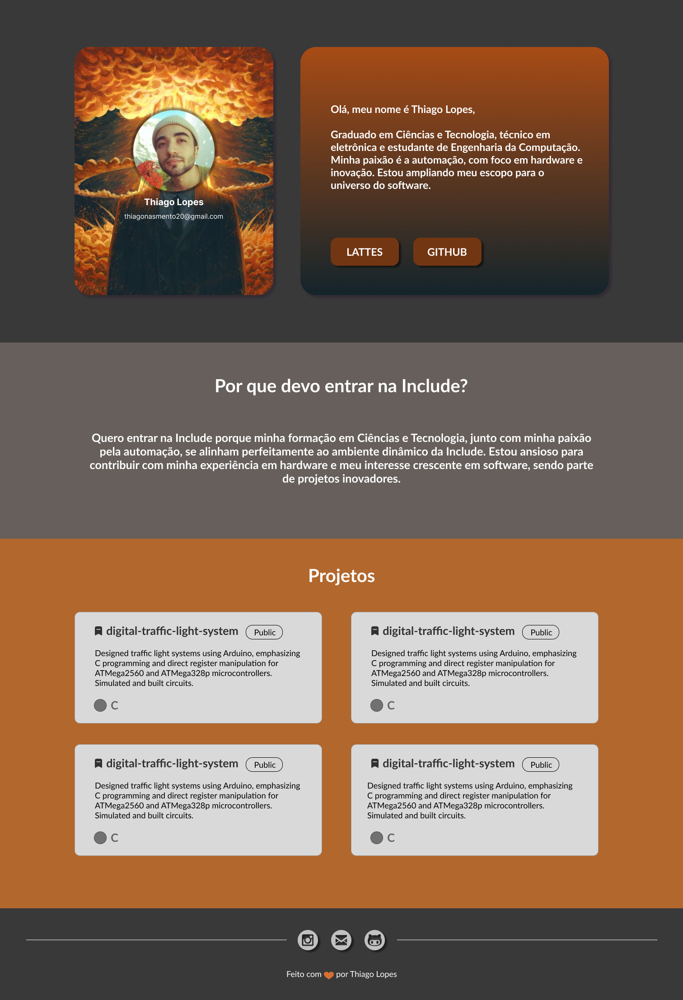

# Portfólio Inspirado no Filme "Oppenheimer"

Este é um projeto pessoal desenvolvido como parte do processo seletivo da empresa júnior Include Engenharia. O objetivo deste projeto é criar um portfólio inspirado no filme "Oppenheimer" que demonstre minhas habilidades e criatividade no desenvolvimento web.

## Visão Geral

O projeto é uma representação criativa do meu trabalho e experiência até o momento, apresentado de uma forma única e inspirada pelo filme "Oppenheimer". Através deste portfólio, desejo destacar minhas habilidades em desenvolvimento web, design e criatividade.

## Tecnologias Utilizadas

- HTML5
- CSS3

## Funcionalidades Principais

- **Perfil:** Esta seção apresenta informações sobre mim, destacando minha experiência, habilidades e interesses.

- **Por que Devo Entrar na Include?:** Nesta parte, destaco as características que me tornam um membro interessante para a empresa Include Engenharia, incluindo minhas habilidades técnicas, experiências relevantes e motivações para me juntar à equipe.

- **Projetos:** Aqui você encontrará links para os repositórios e detalhes dos meus projetos no GitHub. Explore o código, os problemas resolvidos e as contribuições para ter uma visão mais detalhada do meu trabalho prático.

- **Social Links:** Direcionamento para minhas redes sociais. Sinta-se à vontade para me seguir ou entrar em contato através dessas plataformas.

## Como Visualizar

Você pode acessar o meu portfólio online [aqui](https://thiagonasmto.github.io/blog-pessoal-include-engenharia/).

## Designer da página

## Autor

- **Thiago Lopes**

## Agradecimentos

- Agradeço à empresa júnior Include Engenharia pela oportunidade de participar do processo seletivo e desenvolver este projeto.
